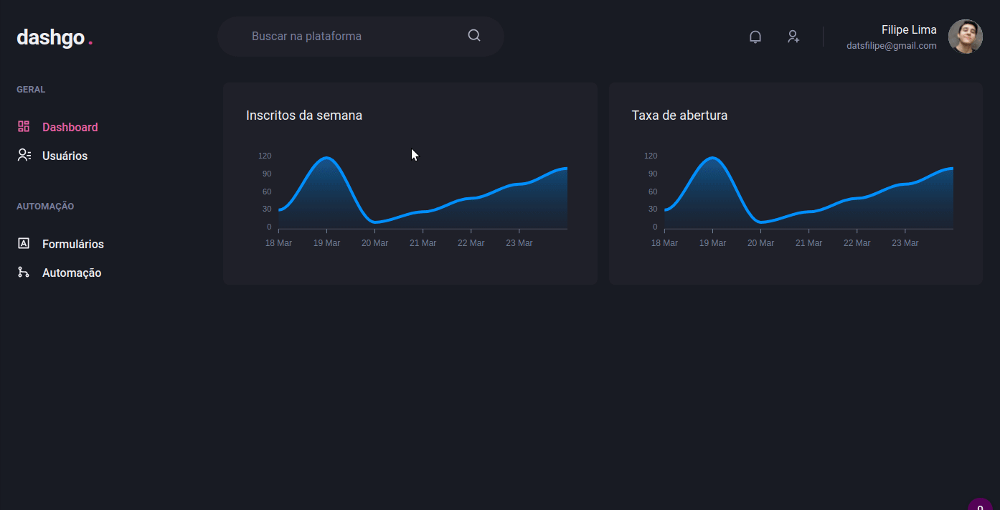

# Dashgo App - Ignite [Chapter 04]

A dashboard app called Dashgo and made with Chakra UI.

**TIP**: The login isn't working, to see the rest of the interface, type dashboard in address.

**Preview**:

  

**Techs**:
  - Next.js
  - React.js
  - Chakra UI
  - React-query
  - React-hooks
  - Framer motion
  - Miragejs

**Running**:
  - Clone the repo with `git clone`
  - Install dependencies with `yarn` or `npm install`
  - Run the app with `yarn dev` or `npm run dev`
